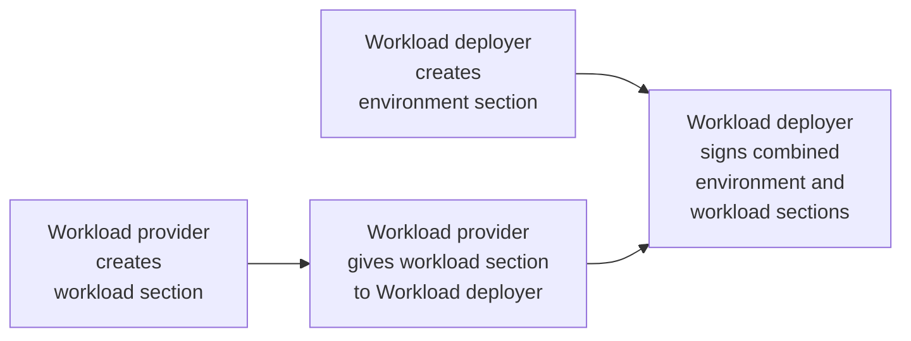

# Create Contract for GREP11 Server

## Overview of this section

IBM provides the Secure Execution feature on z15 and newer generations of its IBM Z and LinuxONE servers.  Currently, that's z15 and LinuxONE III for the "z15" generation and z16 and LinuxONE Emperor 4 for the "z16" generation.

You could create your own Secure Execution-enabled KVM guests and run a workload in it without Hyper Protect Virtual Servers 2.1.x.  However, there's non-trivial work involved in setting this up.  HPVS 2.1.x has done that hard work for you, and provided a KVM guest image that will run your application workload as one or more OCI-compliant (again, think "Docker" in the popular vernacular) containers within the HPVS 2.1.x KVM guest.  There is still some work involved in setting up the contract that HPVS 2.1.x expects- but this is work closer to the _application_ or _business_ level. There is also added value in HPVS 2.1.x in areas such as:

- [x] logging
- [ ] attestation
- [x] verification during boot
- [x] encryption
- [ ] persistent disk protection
- [x] separation of duties

This lab covers the features that are checked in the list above.  (We won't rest on our laurels until we've built this lab out to cover everything under the sun, but, as the saying goes, _Rome wasn't built in a day_).

One of the things we just mentioned in the previous paragraph was _separation of duties_. In a real world situation, multiple personas could create different portions of the contract:

- an _application owner_ deployer might create the _workload_ section of the contract
- a _systems administrator_ might create the _environment_ section of the contract

Then, you could imagine the following scenario taking place:

1. application owner can encrypt their piece of the contract such that it can only be decrypted within the HPVS 2.1.x runtime
2. application owner passes their encrypted piece of the contract to the _systems administrator_
3. the _systems administrator_ encrypts their own section
4. the _systems administrator_ combines the two sections and signs the resultant contract so that it can be verified by the HPVS 2.1.x runtime.

!!! Question "Your inquiring mind may say, well that's all well and good, but what about the disk storage of the machine?"
	
	If your workload requires persistent disk storage (to survive a container restart) then each of the two personas supplies part of a seed that is used in the calculation of an encryption key for the persistent disk. Neither persona has knowledge of the other's part of the seed if it is passed between parties encrypted, so that no human has the ability to decrypt the persistent disk.  The HPVS developers have thought through security very carefully! :nerd_face: 

Now our lab does not include all of the above features (yet)- for example, the GREP11 Server is stateless (this is a feature, not a bug) so we do not need persistent disk storage.  And for this lab, you have and will continue to wear many hats, including both the _application owner_ workload deployer and the _system administrator_ environment deployer.  We are not going to cover _attestation_ in this lab either, but hope to do so in a future lab.

## Creation of directory structure for contract 

This section starts where the last section left off- on your session with the RHEL host:


This command will create the directory structure expected by the lab instructions:

``` bash
mkdir -p ${HOME}/grep11Lab/contract/{workload/compose,environment/rsyslog}
```

Run the `tree` command to see the directory hierarchy you just created:

``` bash
cd ${HOME} && tree grep11Lab/contract
```

???+ info "Expected output from tree command"
      ```
      	[student03@bczkvm(192.168.22.64) ~ [12:23:58] (0)]$ tree grep11Lab/contract
		grep11Lab/contract
		├── environment
		│   └── rsyslog
		└── workload
			└── compose

		4 directories, 0 files
      ```

Read about the directory structure and the purpose of each directory:

| Directory | Purpose |
|---|---|
| grep11Lab/contract | Top-level directory for the contract for the GREP11 Server. Typically, the "workload deployer" signs the concatenation of the encrypted "environment" section that they create and the encrypted "workload" section that the "workload provider" creates. |
| environment | Used by the "workload deployer" persona to hold an encrypted environment section of the contract |
| rsyslog | Used to hold the artifacts needed to construct the logging subsection of the environment section |
| workload | Used by the "workload provider" to hold an encrypted workload section of the contract |
| compose | Used to hold the Docker compose file specifying the application image and supporting files |

A contract requires a _workload_ section and an _environment_ section, so for the lab they each get their own directory. Then the sections are packaged together, and signed, and the signature is added as the third section.  This final result- the contract-  will be stored in your `${HOME}/grep11Lab/contract` directory.

While creating the contract in this lab, you will be performing the role of _workload provider_ and _workload deployer_. In most production scenarios these two roles would be performed by different persons or processes.  The following diagram shows at a high level how these two roles cooperate to form the contract:



## Create workload section of the contract

Hyper Protect Virtual Servers 2.1.x  expects the contract to specify an OCI container in one of two ways- as a _Docker Compose_ file in the _compose_ subsection of the _workload_ section, or as a Pod specification in the _play_ subsection of the _workload_ section. For this lab we will use a  _Docker Compose_ file in the _compose_ subsection of the _workload_ section.  This _Docker Compose_ file will specify an OCI image to run and other information necessary to configure the resulting container. Your workload is the GREP11 Server, so, yes, there's an OCI image for that. The container that runs the GREP11 Server will be configured with information such as:

- the port it listens on
- a configuration file that describes the GREP11 server
- another configuration file that describes its connection to the CENA4SEE server
- certificates and keys to enable TLS communication with the CENA4SEE server
- certificates and keys to enable TLS communication with clients that call the GREP11 Server

That's right, two more "sets" of X509 certificates, egads!!  You've already worked with one set for the rsyslog service, so we'll offer the commands for these next two sets without as much commentary.

!!! Information "A brief history of the term 'CENA4SEE', or, you say to-MAY-toe and I say to-MAH-toe"

        You will not see the term _CENA4SEE_ in any official product documentation.  Try googling it. CENA4SEE is the instructor's abbreviation for _Crypto Express Network API for Secure Execution Enclaves_.  The product documentation often uses the term _c16_.  When the instructor inquired to the developers what _c16_ stood for, because he is sure that customers will ask that question, and was told that it doesn't stand for anything, he coined this acronym and will continue to use it until he is threatened with either legal action or involuntary termination of employment.  

You are going to put the building blocks for the workload section of the contract together in the following order:

1. You will create a docker-compose file

    1. docker-compose.yml - this file will reference each of the files listed in items 2-5 of this list

2. You will create a GREP11 Server configuration file

    1. ep11server.yaml

3. You will create a configuration file for the GREP11 Server to the CENA4SEE server connection

    1. c16client.yaml

4. You will create x509 material to enable secure communication between GREP11 clients and the GREP11 Server 

    1. grep11-ca.pem

    2. grep11-server.pem

    3. grep11-server.key

5. You will create or obtain x509 material to enable secure communication between GREP11 Server and the CENA4SEE server 

    1. c16server-ca.pem - this file has already been created by the instructors

    2. c16server-client.key

    3. c16server-client.pem - the instructors will create this file upon your request in a subsequent step in the lab

    4. c16server-restricted-server.pem - this file has already been created by the instructors

Let's get started!

### Create docker-compose file

Switch to the directory that will hold the docker-compose file and the files referenced by the docker-compose file:

``` bash
cd ${HOME}/grep11Lab/contract/workload/compose
```

Create the docker-compose file:

``` bash
cat << EOF > docker-compose.yml
services:
  $(whoami)-ep11server:
	user: "0"
	image: quay.io/bsilliman/grep11server@sha256:1ebda8a7124c99735f5e7743dfc7ff335dd3e68f7b75f5ca9a41fed6e409d513
	ports:
		- 9876:9876
	volumes:
		- ./c16client.yaml:/etc/c16/c16client.yaml
		- ./c16server-ca.pem:/cfg/c16server-ca.pem
		- ./c16server-client.key:/cfg/c16server-client.key
		- ./c16server-client.pem:/cfg/c16server-client.pem
		- ./c16server-restricted-server.pem:/cfg/c16server-restricted-server.pem
		- ./grep11server.yaml:/etc/ep11server/ep11server.yaml
		- ./grep11-ca.pem:/cfg/grep11-ca.pem
		- ./grep11-server.pem:/cfg/grep11-server.pem
		- ./grep11-server.key:/cfg/grep11-server.key

EOF
```

Notice the value of the _image_ key.  This is the GREP11 Server OCI image provided with the Crypto Express Network API for Secure Execution Enclaves 1.1.2.2 (CENA4SEE) that Barry (_bsilliman_) has uploaded to his account on Quay.io for this lab. (Not for your production usage as it could disappear at any time).

Notice the list of nine items under the _volumes_ section. The left side of each entry in the list specifies the name of the file on the RHEL host.  The value after the ':' specifies where that file is mapped to within the OCI container that will run in the HPVS 2.1.x guest.  Taking the first item in the list as an example, you will create a file named _c16client.yaml_ and then within the OCI container it will be available at _/etc/c16/c16client.yaml_.  (As an aside, you can also map entire directories from your host to a Docker container, although this example only maps individual files).

### Create the configuration file for the GREP11 server

Run this command to create the configuration file for the GREP11 server:

``` bash
cat << EOF > grep11server.yaml
#
# Copyright IBM Corp. All Rights Reserved.
#
# SPDX-License-Identifier: Apache-2.0
#

logging:
  # Package log levels
  # Levels: info, warning, debug, error, fatal, trace, and panic
  levels:
	entry: debug
	# example below
	# entry: info

###################################
## GRPC SERVICES TALKING TO GREP11 server ##
ep11crypto:
  enabled: true
  connection:
	address: 0.0.0.0
	port: 9876

	# Secure connection TLS options
	tls:
		enabled: true
		# certfile, keyfilie and cacert refer to the pem files that holds the certs
		certfile: /cfg/grep11-server.pem
		keyfile: /cfg/grep11-server.key

		mutual: true
		cacert: /cfg/grep11-ca.pem

		# same as above, but instead of filename, contents of PEM can be in an environment
		# variable (i.e. to avoid mounting files into docker container)
		cacertbytes:
		certfilebytes:
		keyfilebytes:

	# Server TCP/IP connection monitoring
	# serverKeepaliveTime is the duration in seconds after which if the server
	# does not see any activity from the client it pings the client to see
	# if it is alive
	# serverKeepaliveTimeout is the duration the server waits for a response
	# from the client after sending a ping before closing the connection
	keepalive:
		serverKeepaliveTime: 30
		serverKeepaliveTimeout: 5

  # Comma-separated list of card.domain tuples. card and domain are hex numbers
  # i.e. "08.0016,0a.0016" corresponds to 22nd (x16) domain on eighth card and 22nd domain on tenth (x0a) card
  domain: "08.0016"
EOF
```
   
### Create the client configuration file for the CENA4SEE server.

1. Run this command to create the client configuration for the the CENA4SEE server:

    ``` bash
    cat << EOF > c16client.yaml
    #trace, debug, info, warn, err, error, critical, off
    loglevel: 'debug'
    servers:
      - hostname: 192.168.22.80
        port: 9001
        mTLS: true
        server_cert_file: "/cfg/c16server-ca.pem"
        client_key_file: "/cfg/c16server-client.key"
        client_cert_file: "/cfg/c16server-client.pem"
        restrict_server_cert_file: "/cfg/c16server-restricted-server.pem"

    EOF
    ```

	!!! Tip "Debug log level for lab purposes"

		For the two configuration files you just created, you set the log level to debug. We would probably not recommend a log level of debug for most normal production use cases but you won't be trodding too heavily on the server in the lab and it provides extra information for your current pursuit of knowledge.

	The value for the hostname in _c16client.yaml_,  _192.168.22.80_, is the IP address of the CENA4SEE server running on the SSC LPAR used in the lab.

2. Pick out the names of the files you will be creating from the _grep11server.yaml_ file with the following command:

	``` bash
	grep -e 'file:' -e 'cacert:' grep11server.yaml
	```

	Your output should look like this:

	???- example "You will create these files in the lab [Click me]"

		```
			certfile: /cfg/grep11-server.pem
			keyfile: /cfg/grep11-server.key
			cacert: /cfg/grep11-ca.pem
		```

3. Pick out the names of the files you will be creating or getting from the instructors from the _c16client.yaml_ file with the following command:

	``` bash
	grep 'file:' c16client.yaml
	```

	???- example "You get the first and fourth files and create the other two [Click me]"

		```
			server_cert_file: "/cfg/c16server-ca.pem"
			client_key_file: "/cfg/c16server-client.key"
			client_cert_file: "/cfg/c16server-client.pem"
			restrict_server_cert_file: "/cfg/c16server-restricted-server.pem"
		```

### Create x509 material for GREP11 client to GREP11 Server communication

Your GREP11 Server acts as both a server and a client. Its primary purpose is to be a server- to serve requests from GREP11 clients.  But in order to get its job done, the GREP11 Server must send requests to the CENA4SEE server, so it is a client to the CENA4SEE server.  (It is also a client to the rsyslog service so that it can send its log messages there). 

In this section, you'll set up the material to enable the GREP11 Server's role as a, well, GREP11 Server!

1. Create and change to a new directory which you will use for your self-signed GREP11 Server CA:

	``` bash
	mkdir -p ${HOME}/grep11Lab/x509Work/GREP11Server/{CA,server,clients} \
	&& cd ${HOME}/grep11Lab/x509Work/GREP11Server/CA
	```

	(The above command also creates some other directories that you'll use later in the lab)

2. Create an RSA private key for your self-signed GREP11 Server CA:

	``` bash
	openssl genrsa -out grep11-ca-key.pem 2048
	```

3. Create a configuration file to assist in creation of your self-signed CA for the GREP11 Server:

	``` bash
	cat << EOF > ca.cnf

	[ req ]
	default_bits           = 2048
	default_keyfile        = keyfile.pem
	distinguished_name     = req_distinguished_name
	attributes             = req_attributes
	prompt                 = no
	output_password        = mypass

	[ req_distinguished_name ]
	C                      = US
	ST                     = Virginia
	L                      = Herndon
	O                      = IBM
	OU                     = Washington Systems Center - IBM Z and LinuxONE
	CN                     = WSC $(whoami) HPVS CA
	emailAddress           = student@notreal.email.com

	[ req_attributes ]
	challengePassword              = A challenge password

	[ x509_extensions ]
	subjectKeyIdentifier   = hash
	authorityKeyIdentifier = keyid,issuer
	basicConstraints       = critical,CA:TRUE

	EOF
	```

4. Create your self-signed CA for the GREP11 Server. Notice it uses the private key you created two commands ago and refers to the configuration file your last command created:

	``` bash
	openssl req -new -x509 \
          -key grep11-ca-key.pem \
          -out grep11-ca.pem \
          -days 395 -config ca.cnf \
          -extensions x509_extensions
	```

5. Display the CA certificate that you just created:

	``` bash
	openssl x509 -noout -text -in grep11-ca.pem
	```

	Your output will look similar to this:

	???- example "Example of display of certificate:"

		```
		Certificate:
			Data:
				Version: 3 (0x2)
				Serial Number:
					61:1d:d1:10:f4:34:bd:84:7b:ca:0b:59:2b:cf:1e:e2:16:5a:01:5c
				Signature Algorithm: sha256WithRSAEncryption
				Issuer: C = US, ST = Virginia, L = Herndon, O = IBM, OU = Washington Systems Center - IBM Z and LinuxONE, CN = WSC student02 HPVS CA, emailAddress = student@notreal.email.com.com
				Validity
					Not Before: Feb 14 14:36:41 2023 GMT
					Not After : Mar 15 14:36:41 2024 GMT
				Subject: C = US, ST = Virginia, L = Herndon, O = IBM, OU = Washington Systems Center - IBM Z and LinuxONE, CN = WSC student02 HPVS CA, emailAddress = student@notreal.email.com
				Subject Public Key Info:
					Public Key Algorithm: rsaEncryption
						RSA Public-Key: (2048 bit)
						Modulus:
							00:a6:56:f3:c4:81:58:e0:d5:cd:87:28:38:bc:6b:
							e3:0f:b4:c7:61:2e:bd:4e:17:b0:a2:65:2e:ad:63:
							d1:2a:b4:a2:45:d6:f3:9d:ba:8a:0d:66:72:fd:15:
							b1:d3:4c:08:ff:3c:8d:c0:c4:23:86:c2:65:18:19:
							35:03:bb:3c:d5:e2:7a:66:47:4a:6e:d1:eb:37:3f:
							f7:62:c0:35:45:5f:38:7a:2f:4a:1e:aa:f7:8b:4a:
							55:6f:bb:b4:e3:1e:a6:62:20:55:df:1f:04:1e:70:
							73:c5:32:b5:5e:77:6f:45:6d:43:fd:01:76:84:83:
							6f:c8:9a:6e:20:27:81:94:af:e7:fb:7c:c0:8c:91:
							bf:f1:47:d3:05:a7:56:69:29:bd:1b:59:0d:54:c0:
							53:e1:d8:58:a9:f1:d1:fb:d4:c0:e1:9d:f3:f2:36:
							51:ff:60:2a:91:28:9d:07:5e:27:5f:3a:68:f0:7e:
							5a:29:cb:1a:5e:b1:c5:98:e1:14:fa:38:29:67:81:
							4e:e3:4b:a2:bb:c7:c3:b5:24:c4:d4:c5:23:d8:70:
							2b:98:97:e2:ef:26:32:5a:ea:02:ea:3f:48:90:7f:
							a5:6f:b3:49:68:0a:31:d6:c9:18:c8:57:f7:7c:e0:
							4d:e4:46:f7:3c:30:7a:4a:16:df:f4:c9:b7:d8:c0:
							e7:bb
						Exponent: 65537 (0x10001)
				X509v3 extensions:
					X509v3 Subject Key Identifier: 
						E3:62:2B:39:9A:DB:57:77:DE:A2:C5:7E:11:A6:76:22:5F:F7:91:9D
					X509v3 Authority Key Identifier: 
						keyid:E3:62:2B:39:9A:DB:57:77:DE:A2:C5:7E:11:A6:76:22:5F:F7:91:9D

					X509v3 Basic Constraints: critical
						CA:TRUE
			Signature Algorithm: sha256WithRSAEncryption
				88:11:95:13:b8:fb:f8:b0:67:2c:a7:8f:d5:7b:27:24:e1:77:
				45:4a:9d:af:fe:8b:34:f8:84:dc:80:69:a6:fb:50:5f:ce:86:
				5d:a2:30:f5:f0:d9:1b:7a:92:9e:c1:69:78:f3:42:65:9f:2f:
				3e:c9:61:96:bf:93:5a:4f:e9:70:16:de:b1:91:78:b7:0a:38:
				2c:54:6c:21:32:be:90:e9:b5:25:29:d7:df:b2:a5:86:2d:bc:
				04:9a:ca:ee:cb:1b:29:02:6e:59:4f:86:85:d9:06:a3:1b:8e:
				94:df:9b:9b:56:20:f2:33:02:3c:ff:17:c3:46:04:2d:db:64:
				1a:0f:9d:7b:2d:b6:af:dd:c4:5b:ad:70:89:09:5d:3b:02:b7:
				74:24:79:e2:b5:a4:1a:ed:f9:8a:55:73:f6:20:4d:4f:88:42:
				24:77:08:92:09:7d:42:2e:40:88:fa:42:1a:2b:10:b6:8f:28:
				a1:b8:33:7c:99:fa:c6:29:0f:50:85:cd:f7:e0:b1:b7:ea:14:
				0f:ac:a6:cd:16:3a:a9:7a:0e:f4:13:b5:35:f0:87:0d:5d:67:
				d3:14:c3:e8:0e:b7:b1:4f:60:0b:c5:ca:23:93:6e:38:15:ee:
				0b:e4:97:79:f9:97:43:ff:9d:42:f5:ea:80:96:d7:7b:b3:2b:
				d1:4d:7f:36
		```

	Within your `${HOME}/grep11Lab/x509Work/GREP11Server/CA` directory, you are a certification authority!

6. If you change to this directory, you will be soon be a customer of your CA:

	``` bash
	cd ${HOME}/grep11Lab/x509Work/GREP11Server/server
	```

7. You want to create a certificate for your GREP11 Server to use for authenticating to GREP11 clients.  Start by creating an RSA private key:

	``` bash
	openssl genrsa -out grep11-server.key 2048
	```

8. Create a configuration file to assist the creation of your GREP11 Server's CSR:

	``` bash
	cat << EOF > serverCSR.cnf
	# OpenSSL configuration file.
	#

	# Establish working directory.

	dir   = .

	[ ca ]
	default_ca  = CA_default

	[ CA_default ]
	serial   = $dir/serial
	default_days  = 365
	default_md  = sha256
	preserve  = no
	email_in_dn  = no
	nameopt   = default_ca
	certopt   = default_ca
	default_crl_days = 45
	policy   = policy_match

	[ policy_match ]
	countryName  = match
	stateOrProvinceName = optional
	organizationName = match
	organizationalUnitName = optional
	commonName  = supplied
	emailAddress  = optional

	[ req ]
	default_md  = sha256
	distinguished_name = req_distinguished_name
	prompt             = no

	[ req_distinguished_name ]

	C  = US
	ST = Virginia
	L  = Herndon
	O  = IBM  
	OU = Washington Systems Center - IBM Z and LinuxONE

	CN = \$ENV::COMMON_NAME

	EOF
	```

9. Create the certificate signing request:

	``` bash
	COMMON_NAME=${GREP11ServerIP}  openssl req -new -key grep11-server.key \
		-out grep11-server.csr -config serverCSR.cnf
	```

10. In your current directory, `${HOME}/grep11Lab/x509Work/GREP11Server/server`, you are a "customer" of the CA you created in `${HOME}/grep11Lab/x509Work/GREP11Server/CA`. 
	Thus, "send" your CSR to your CA:

	``` bash
	cp -ipv grep11-server.csr ${HOME}/grep11Lab/x509Work/GREP11Server/CA/.
	```

11. Put your CA hat back on and go to the CA directory:

	``` bash
	cd ${HOME}/grep11Lab/x509Work/GREP11Server/CA/
	```

12. Create a configuration file to assist the creation of your GREP11 Server certificate:

	``` bash
	cat << EOF > server.cnf
	# OpenSSL configuration file.
	#

	# Establish working directory.

	dir   = .

	[ ca ]
	default_ca  = CA_default

	[ CA_default ]
	serial   = $dir/serial
	default_days  = 365
	default_md  = sha256
	preserve  = no
	email_in_dn  = no
	nameopt   = default_ca
	certopt   = default_ca
	default_crl_days = 45
	policy   = policy_match

	[ policy_match ]
	countryName  = match
	stateOrProvinceName = optional
	organizationName = match
	organizationalUnitName = optional
	commonName  = supplied
	emailAddress  = optional

	[ req ]
	default_md  = sha256
	distinguished_name = req_distinguished_name
	prompt             = no

	[ req_distinguished_name ]
	C  = US
	ST = Virginia
	L  = Herndon
	O  = IBM  
	OU = Washington Systems Center - IBM Z and LinuxONE
	CN = \${ENV::COMMON_NAME}

	[ server ]
	basicConstraints = CA:FALSE
	keyUsage = digitalSignature, keyEncipherment, dataEncipherment
	extendedKeyUsage = serverAuth
	nsCertType = server
	crlDistributionPoints = @crl
	subjectAltName = \${ENV::SUBJECT_ALT_NAME}

	[ crl ]
	URI=http://localhost/ca.crl

	EOF
	```

13. Now, create the certificate:

	``` bash
	SUBJECT_ALT_NAME=DNS:192.168.22.64:${GREP11ServerForwardedPort},IP:192.168.22.64,DNS:${GREP11ServerIP}:9876,IP:${GREP11ServerIP} \
		COMMON_NAME=${GREP11ServerIP} openssl x509 -sha256 -req \
		-in grep11-server.csr -CA grep11-ca.pem -CAkey grep11-ca-key.pem \
		-set_serial 8086 -extfile server.cnf -extensions server \
		-days 390 -outform PEM -out grep11-server.pem
	```

	???- example "Example output from certificate creation"

		```
		Signature ok
		subject=C = US, ST = Virginia, L = Herndon, O = IBM, OU = Washington Systems Center - IBM Z and LinuxONE, CN = 172.16.0.61
		Getting CA Private Key
		```

14. Display the info of the certificate you just created:

	``` bash
	openssl x509 -noout -text -in grep11-server.pem

	```      

	Your certificate will look similar to this:

	???- example "Certificate info"

		```
		Certificate:
			Data:
				Version: 3 (0x2)
				Serial Number: 8086 (0x1f96)
				Signature Algorithm: sha256WithRSAEncryption
				Issuer: C = US, ST = Virginia, L = Herndon, O = IBM, OU = Washington Systems Center - IBM Z and LinuxONE, CN = WSC student02 HPVS CA, emailAddress = student@notreal.email.com.com
				Validity
					Not Before: Feb 14 14:47:20 2023 GMT
					Not After : Mar 10 14:47:20 2024 GMT
				Subject: C = US, ST = Virginia, L = Herndon, O = IBM, OU = Washington Systems Center - IBM Z and LinuxONE, CN = 172.16.0.61
				Subject Public Key Info:
					Public Key Algorithm: rsaEncryption
						RSA Public-Key: (2048 bit)
						Modulus:
							00:ac:16:8c:e2:82:f2:18:4d:b0:c2:6b:1e:62:93:
							a2:6b:58:8f:eb:60:78:49:20:e1:68:64:d9:b7:a1:
							a7:3d:ce:ae:ca:f9:86:8e:c8:bd:f8:fc:e3:b6:bb:
							19:7d:d7:8d:59:36:c6:d6:63:44:d3:14:06:ff:92:
							d6:ee:c9:fe:ad:4c:a0:fe:c6:96:fa:5b:29:e4:bd:
							08:0b:da:1a:d0:38:eb:f6:90:12:a4:34:a4:b3:21:
							63:31:06:32:19:9b:33:d6:f1:93:36:f1:b7:27:c3:
							8f:9b:31:c7:ce:e9:b6:61:15:48:c7:a2:c6:80:18:
							46:79:73:75:67:6d:78:d1:ec:28:19:24:fc:72:38:
							37:49:be:05:60:54:0c:9f:fe:52:5f:a1:16:77:98:
							fc:a3:d8:2e:fe:f3:b2:4f:eb:2f:45:ad:b1:c9:35:
							05:f3:ab:e5:44:13:24:53:e9:67:93:47:08:a8:42:
							f3:68:61:66:14:65:d2:c1:fe:09:05:06:3d:5f:72:
							5c:8b:8b:6b:c4:13:3d:71:9b:f3:5b:29:95:33:e4:
							3e:d4:1a:04:9a:93:71:07:ec:02:58:c9:f2:47:b8:
							d3:dc:db:6f:c4:bc:ff:67:e9:b0:bb:f7:5e:f8:ca:
							a4:cf:5e:ef:05:cf:06:25:56:1e:c4:ee:24:0d:4e:
							c9:e7
						Exponent: 65537 (0x10001)
				X509v3 extensions:
					X509v3 Basic Constraints: 
						CA:FALSE
					X509v3 Key Usage: 
						Digital Signature, Key Encipherment, Data Encipherment
					X509v3 Extended Key Usage: 
						TLS Web Server Authentication
					Netscape Cert Type: 
						SSL Server
					X509v3 CRL Distribution Points: 

						Full Name:
						URI:http://localhost/ca.crl

					X509v3 Subject Alternative Name: 
						DNS:192.168.22.64:19878, IP Address:192.168.22.64, DNS:172.16.0.61:9876, IP Address:172.16.0.61
			Signature Algorithm: sha256WithRSAEncryption
				84:1e:74:25:f5:7b:d5:c4:d1:7a:7e:5d:c6:84:87:96:2a:75:
				7c:20:ce:40:c4:8d:54:d5:2a:cd:53:81:b6:c0:46:73:e8:55:
				88:ac:8c:21:0e:71:3c:1a:8f:3e:25:34:55:fc:aa:23:dc:9b:
				ba:0b:5f:4a:e3:c3:09:d6:c4:d7:4c:27:a1:d3:d2:0d:f0:a2:
				e0:64:d2:89:b6:61:18:1e:c9:a7:ee:66:fb:36:53:58:3d:a9:
				5c:03:4a:fa:5f:e7:10:08:5a:8b:e0:24:1a:90:48:b2:1c:5e:
				63:d9:23:60:24:80:5f:f6:27:7e:9f:6c:d9:9e:58:98:71:80:
				e3:ea:1b:fa:4a:dc:67:7e:e9:23:fe:5f:d1:09:a9:3f:bc:6e:
				9b:09:47:3a:4e:df:50:8d:26:0f:e2:75:25:ec:ce:80:1d:a7:
				38:29:ef:b2:d6:f0:4e:7d:68:c2:b4:7e:00:7a:ff:79:8f:32:
				8e:c1:79:54:38:3a:40:de:6b:d3:b7:6f:31:7d:ac:71:7e:37:
				27:ac:7c:e7:b9:7e:12:b2:78:41:68:f4:5e:35:77:8c:d9:3c:
				94:f7:0f:95:1c:1b:31:62:9c:f9:99:09:2c:60:03:7c:9c:c1:
				56:c7:a0:7e:7b:0e:c3:22:42:95:76:ee:9c:1a:b4:e5:a8:a8:
				6d:0f:b3:1f
		```

15. "Send" the completed certificate to the "customer":

	``` bash
	cp -ipv grep11-server.pem ${HOME}/grep11Lab/x509Work/GREP11Server/server/.
	``` 

16. Also send your public certificate to the customer as they will need it to verify certificates that are sent by their connection partners. (GREP11 clients in this case).

	``` bash
	cp -ipv grep11-ca.pem ${HOME}/grep11Lab/x509Work/GREP11Server/server/.
	```

17. From the work you've done in this section, three files are referenced in the Docker Compose file you created earlier-  the GREP11 Server CA's self-signed certificate, and the GREP11 Server's certificate and private key.  Copy them into the same directory that holds your Docker Compose file:

	``` bash
	cp -ipv ${HOME}/grep11Lab/x509Work/GREP11Server/server/{grep11-ca.pem,grep11-server.pem,grep11-server.key} \
	${HOME}/grep11Lab/contract/workload/compose/.
	```

	???- example "Example output from cp command"

		```
		'/home/student07/grep11Lab/x509Work/GREP11Server/server/grep11-ca.pem' -> '/home/student07/grep11Lab/contract/workload/compose/./grep11-ca.pem'
		'/home/student07/grep11Lab/x509Work/GREP11Server/server/grep11-server.pem' -> '/home/student07/grep11Lab/contract/workload/compose/./grep11-server.pem'
		'/home/student07/grep11Lab/x509Work/GREP11Server/server/grep11-server.key' -> '/home/student07/grep11Lab/contract/workload/compose/./grep11-server.key'
		```

### Create x509 material for GREP11 Server to CENA4SEE Server communication

1. Run this command to find the word _volumes_ in the **docker-compose.yml** file and then print it and the next nine lines (_--after-context 9_):

	``` bash
	grep --after-context 9 volumes \
	${HOME}/grep11Lab/contract/workload/compose/docker-compose.yml
	```

	???- example "Expected output"

		```
                        volumes:
                            - ./c16client.yaml:/etc/c16/c16client.yaml
                            - ./c16server-ca.pem:/cfg/c16server-ca.pem
                            - ./c16server-client.key:/cfg/c16server-client.key
                            - ./c16server-client.pem:/cfg/c16server-client.pem
                            - ./c16server-restricted-server.pem:/cfg/c16server-restricted-server.pem
                            - ./grep11server.yaml:/etc/ep11server/ep11server.yaml
                            - ./grep11-ca.pem:/cfg/grep11-ca.pem
                            - ./grep11-server.pem:/cfg/grep11-server.pem
                            - ./grep11-server.key:/cfg/grep11-server.key
		```

	Of the nine files, you have created five of them:

	- [x] 2 _.yaml_ files
	- [x] 3 _grep11-\*_ files
	- [ ] 4 _c16server\*_ files

2. Now it is time to create or acquire the four files called for from _c16client.yaml_.


	There is only one CENA4SEE server that all of the lab students will use.  The instructors have set this up, and have created the both the "self-signed" CA that governs communication between the CENA4SEE server and its clients (each student's GREP11 Server is a client of the CENA4SEE server), and the certificate for the CENA4SEE server itself. You need to acquire these certificates that the instructors created:

	```bash
	cp -ipv /data/lab/c16server-public/{c16server-ca.pem,c16server-restricted-server.pem} \
	${HOME}/grep11Lab/contract/workload/compose/.
	```

3. You just got the instructor-provided certificates, so now it's time to start the process of creating a certificate that will allow your GREP11 Server to make calls to the CENA4SEE.  Start by creating another working directory and switching to it.

	``` bash
	mkdir -p ${HOME}/grep11Lab/x509Work/CENA4SEEClient \
	&& cd ${HOME}/grep11Lab/x509Work/CENA4SEEClient
	```

3. Create an RSA private key using _certtool_:

	!!! Info "Certtool"

		You used _openssl_ for your previous certificate work.  You will use another tool called _certtool_ now.  

	``` bash
	certtool --generate-privkey --outfile c16server-client.key
	```

	???- example "Output from private key creation"

		```
		Generating a 3072 bit RSA private key...
		```

4. Create the following template file to avoid being asked questions from _certtool_:

	``` bash
	cat << EOF > csr.cfg
	# The common name of the certificate owner.
	cn = "c16client"

	# The organizational unit of the subject.
	unit = "IBM WSC IBM Z and LinuxONE"

	# The organization of the subject
	organization = "IBM WSC"

	# The location of the subject
	locality = "Herndon"

	# The state of the subject.
	state = "Virginia"

	# The country of the subject. Two letter code.
	country = "US"

	# The subject's domain component
	dc = "bczkvm"

	# A dnsname 
	dns_name = ${GREP11ServerIP}

	# An IP address 
	ip_address = ${GREP11ServerIP}

	# Use certificate for TLS client
	tls_www_client
	EOF
	```

5. Now create a CSR:

	``` bash
	certtool --generate-request \
		--load-privkey c16server-client.key \
		--template csr.cfg \
		--outfile c16server-client.csr 
	```

	???- example "Output from creating CSR"

		```
		Generating a PKCS #10 certificate request...
		```

6. Display information about your CSR:

	``` bash
	certtool --crq-info --infile c16server-client.csr
	```

	Your output should look similar to this:

	???- example "Example CSR info"

		```
		PKCS #10 Certificate Request Information:
				Version: 1
				Subject: DC=bczkvm,C=US,ST=Virginia,L=Herndon,O=IBM WSC,OU=IBM WSC IBM Z and LinuxONE,CN=c16client
				Subject Public Key Algorithm: RSA
				Algorithm Security Level: High (3072 bits)
					Modulus (bits 3072):
						00:b8:89:6a:97:6f:fd:78:30:e0:c0:16:0e:64:42:fa
						e6:b9:6b:b1:c2:fd:25:c2:0f:f6:9d:f8:29:14:c5:38
						0f:a2:0e:57:07:30:4f:bb:23:03:af:52:fb:65:e5:5b
						e6:fe:93:21:74:8d:5c:e3:de:e0:1c:3b:47:1f:2f:4d
						c2:8d:e1:87:01:f7:6b:d9:c0:5d:c4:2e:53:d1:64:39
						90:be:a9:76:38:5b:52:14:aa:26:b1:9c:1b:24:18:f4
						7c:d7:02:27:3d:08:4a:16:b3:83:c5:70:37:d9:ae:a9
						b4:94:cf:a9:77:d0:96:19:f1:06:5d:5e:b6:ff:76:85
						d3:88:fe:b1:b3:40:a7:75:61:1b:d8:23:93:1f:01:3f
						4a:5e:a3:4b:95:26:36:37:b7:3e:14:c8:dc:c2:d1:1c
						ee:0a:60:a8:57:18:c1:ef:6f:9a:4f:e7:95:93:6a:a6
						15:41:34:d1:9c:51:f6:74:28:5c:79:cb:61:86:f2:73
						db:f0:7d:78:1b:4f:a2:08:92:c5:6d:8f:11:02:28:fd
						70:27:17:88:7f:6c:42:d5:c5:90:06:06:34:a7:bc:cd
						d9:c5:c3:4e:00:48:88:7b:d4:53:d2:63:9e:c6:6e:a8
						6e:29:a5:57:38:7d:c3:02:05:8c:ec:83:95:43:b9:5e
						28:fd:1d:a0:9d:b0:98:58:2e:31:b4:fd:78:75:e7:6a
						40:60:eb:1c:53:eb:ef:31:6a:fd:96:49:c1:db:c7:53
						c6:f8:ca:7c:db:c3:16:31:37:32:2e:25:ed:d4:96:08
						4e:bc:ce:04:b2:ed:c4:91:c1:72:1b:b0:9f:16:3d:17
						df:0f:b3:b7:4d:25:db:c4:ad:b4:42:b9:b2:a8:3c:41
						52:5c:d7:20:40:62:61:29:cf:89:0f:29:db:e9:53:17
						51:65:fc:50:0b:79:13:b5:d6:ab:cb:f8:92:e2:e9:b5
						0d:87:d3:c9:5f:d1:dc:c7:03:c4:e9:6c:ce:f2:09:22
						f1
					Exponent (bits 24):
						01:00:01
			Signature Algorithm: RSA-SHA256
				Attributes:
					Extensions:
						Subject Alternative Name (not critical):
							DNSname: 172.16.0.61
							IPAddress: 172.16.0.61
						Basic Constraints (critical):
							Certificate Authority (CA): FALSE
						Key Usage (critical):
							Digital signature.
						Key Purpose (critical):
							TLS WWW Client.
		Other Information:
				Public Key ID:
					sha1:70d0427d152be23fc9015be370581d19f3c47ff7
					sha256:8f5547027afe8e10cd64d840903692e6a703b61a63fdbaebf9e0f446013a2ee6
				Public Key PIN:
					pin-sha256:j1VHAnr+jhDNZNhAkDaS5qcDthpj/brr+eD0RgE6LuY=

		Self signature: verified

		-----BEGIN NEW CERTIFICATE REQUEST-----
		MIIERDCCAqwCAQAwgZgxEjAQBgNVBAMTCWMxNmNsaWVudDEmMCQGA1UECxMdSUJN
		IFdTQyB6U3lzdGVtcyBhbmQgTGludXhPTkUxEDAOBgNVBAoTB0lCTSBXU0MxEDAO
		BgNVBAcTB0hlcm5kb24xETAPBgNVBAgTCFZpcmdpbmlhMQswCQYDVQQGEwJVUzEW
		MBQGCgmSJomT8ixkARkWBmJjemt2bTCCAaIwDQYJKoZIhvcNAQEBBQADggGPADCC
		AYoCggGBALiJapdv/Xgw4MAWDmRC+ua5a7HC/SXCD/ad+CkUxTgPog5XBzBPuyMD
		r1L7ZeVb5v6TIXSNXOPe4Bw7Rx8vTcKN4YcB92vZwF3ELlPRZDmQvql2OFtSFKom
		sZwbJBj0fNcCJz0IShazg8VwN9muqbSUz6l30JYZ8QZdXrb/doXTiP6xs0CndWEb
		2COTHwE/Sl6jS5UmNje3PhTI3MLRHO4KYKhXGMHvb5pP55WTaqYVQTTRnFH2dChc
		ecthhvJz2/B9eBtPogiSxW2PEQIo/XAnF4h/bELVxZAGBjSnvM3ZxcNOAEiIe9RT
		0mOexm6obimlVzh9wwIFjOyDlUO5Xij9HaCdsJhYLjG0/Xh152pAYOscU+vvMWr9
		lknB28dTxvjKfNvDFjE3Mi4l7dSWCE68zgSy7cSRwXIbsJ8WPRffD7O3TSXbxK20
		QrmyqDxBUlzXIEBiYSnPiQ8p2+lTF1Fl/FALeRO11qvL+JLi6bUNh9PJX9HcxwPE
		6WzO8gki8QIDAQABoGYwZAYJKoZIhvcNAQkOMVcwVTAcBgNVHREEFTATggsxNzIu
		MTYuMC42MYcErBAAPTAMBgNVHRMBAf8EAjAAMA8GA1UdDwEB/wQFAwMHgAAwFgYD
		VR0lAQH/BAwwCgYIKwYBBQUHAwIwDQYJKoZIhvcNAQELBQADggGBAA17uU7a2aJx
		FNi2syniSomFbZSVQBBTJop7mplzpdyH+/IN/2eJU6wakXuuvCp6Yo2UYd6wMD5V
		jl9AuZssXYZZRxfCzLtZ/KhCmNzFqnJIGMPpaPW5W72Jtmo3GE1VRRYEnVGZGqbx
		hnUzY0uiHThT+M31P+ZwpYwsPZmWYm0zBT2NfMAPpgYC0EqXstSqUdksgK1Qxa/L
		T3pede66CtIDbO+cRCv2ITWyfElZ7HZU93fDAG+R9kSMQDxNyjFQQ1H/b0F155hZ
		DjkGJ/VSU5RAv59oud4ZUYkGFOFOXlH+4fRhszAGOA53mDGUxL+Oh1VuYijeWyWo
		kepWkbYZ1o39pb5Zj1PEN6V2pwrLVg1My0VWNoxgnOWVJOGUnAt1jFYo+1fNMBsg
		xx44AFTZKvKJmHoOnbcSw/maVqg8taeF4vyPHOddsrK9fC4lg5+ZWrLoqhh7t0Ac
		TNVxGDGmyklOsttcINyIfbyQGMUTURDEDYLl7xLNX8IFTcG+xtlS1g==
		-----END NEW CERTIFICATE REQUEST-----
		```


        

	The "self-signed" CA for the CENA4SEE server is under instructor control- since there is only one CENA4SEE for the class to share, there is only one CA.  Let the instructors know that you are ready to have a client certificate created and the instructors will create a certificate for you and place it in the same directory that you are presently working in.  

	!!! Info "How the instructors will create this certificate for you"

		In the interests of transparency, this is the command the instructors will use to create your certificate (after setting the _${student}_ environment variable appropriately).  Don't try to run this command as it won't work for you because you do not have access to the "self-signed" CA's private key.  (You can try- if you succeed, you are either an excellent hacker, or the instructors are not excellent system administrators, or some combination thereof).

		``` bash
		### for your information only
		certtool --generate-certificate \
		--load-request /home/${student}/grep11Lab/x509Work/CENA4SEEClient/c16server-client.csr \
		--outfile ${student}-c16server-client.pem \
		--load-ca-certificate c16server-ca.pem \
		--load-ca-privkey c16server-ca.key \
		--template cert.cfg 

		cp -ipv ${student}-c16server-client.pem \
		/home/${student}/grep11Lab/x509Work/CENA4SEEClient/c16server-client.pem

		chown ${student}:hpvs_students \
		/home/${student}/grep11Lab/x509Work/CENA4SEEClient/c16server-client.pem 
		```

		This is also for information only- it is the contents of the configuration file _cert.cfg_ that the instructors use in the above command:

		``` cfg title="cert.cfg"
		# Expiration days
		expiration_days = 300

		# Honor certificate request extensions 
		#honor_crq_extensions

		# keyUsage 
		honor_crq_ext = 2.5.29.15

		# extKeyUsage
		honor_crq_ext = 2.5.27.39

		# subjectAltName
		honor_crq_ext = 2.5.29.17

		# basicConstraints
		honor_crq_ext = 2.5.29.19

		tls_www_client
		```

7. After the instructors notify you that your certificate is ready :clock:, display it:

	``` bash
	certtool --certificate-info --infile c16server-client.pem
	```

	Your certificate will look like this:

	???- example "CENA4SEE client certificate info"

		```
		X.509 Certificate Information:
				Version: 3
				Serial Number (hex): 6c8e1ecbc1ee385c441c03bd1dd64759641c5073
				Issuer: DC=hpvs1,C=US,ST=Virginia,L=Herndon,O=IBM WSC IBM Z and LinuxONE,OU=IBM WSC,CN=c16server CA
				Validity:
					Not Before: Tue Feb 14 15:41:45 UTC 2023
					Not After: Mon Dec 11 15:41:45 UTC 2023
				Subject: DC=bczkvm,C=US,ST=Virginia,L=Herndon,O=IBM WSC,OU=IBM WSC IBM Z and LinuxONE,CN=c16client
				Subject Public Key Algorithm: RSA
				Algorithm Security Level: High (3072 bits)
					Modulus (bits 3072):
						00:b8:89:6a:97:6f:fd:78:30:e0:c0:16:0e:64:42:fa
						e6:b9:6b:b1:c2:fd:25:c2:0f:f6:9d:f8:29:14:c5:38
						0f:a2:0e:57:07:30:4f:bb:23:03:af:52:fb:65:e5:5b
						e6:fe:93:21:74:8d:5c:e3:de:e0:1c:3b:47:1f:2f:4d
						c2:8d:e1:87:01:f7:6b:d9:c0:5d:c4:2e:53:d1:64:39
						90:be:a9:76:38:5b:52:14:aa:26:b1:9c:1b:24:18:f4
						7c:d7:02:27:3d:08:4a:16:b3:83:c5:70:37:d9:ae:a9
						b4:94:cf:a9:77:d0:96:19:f1:06:5d:5e:b6:ff:76:85
						d3:88:fe:b1:b3:40:a7:75:61:1b:d8:23:93:1f:01:3f
						4a:5e:a3:4b:95:26:36:37:b7:3e:14:c8:dc:c2:d1:1c
						ee:0a:60:a8:57:18:c1:ef:6f:9a:4f:e7:95:93:6a:a6
						15:41:34:d1:9c:51:f6:74:28:5c:79:cb:61:86:f2:73
						db:f0:7d:78:1b:4f:a2:08:92:c5:6d:8f:11:02:28:fd
						70:27:17:88:7f:6c:42:d5:c5:90:06:06:34:a7:bc:cd
						d9:c5:c3:4e:00:48:88:7b:d4:53:d2:63:9e:c6:6e:a8
						6e:29:a5:57:38:7d:c3:02:05:8c:ec:83:95:43:b9:5e
						28:fd:1d:a0:9d:b0:98:58:2e:31:b4:fd:78:75:e7:6a
						40:60:eb:1c:53:eb:ef:31:6a:fd:96:49:c1:db:c7:53
						c6:f8:ca:7c:db:c3:16:31:37:32:2e:25:ed:d4:96:08
						4e:bc:ce:04:b2:ed:c4:91:c1:72:1b:b0:9f:16:3d:17
						df:0f:b3:b7:4d:25:db:c4:ad:b4:42:b9:b2:a8:3c:41
						52:5c:d7:20:40:62:61:29:cf:89:0f:29:db:e9:53:17
						51:65:fc:50:0b:79:13:b5:d6:ab:cb:f8:92:e2:e9:b5
						0d:87:d3:c9:5f:d1:dc:c7:03:c4:e9:6c:ce:f2:09:22
						f1
					Exponent (bits 24):
						01:00:01
				Extensions:
					Key Usage (critical):
						Digital signature.
					Subject Alternative Name (not critical):
						DNSname: 172.16.0.61
						IPAddress: 172.16.0.61
					Basic Constraints (critical):
						Certificate Authority (CA): FALSE
					Key Purpose (not critical):
						TLS WWW Client.
					Subject Key Identifier (not critical):
						70d0427d152be23fc9015be370581d19f3c47ff7
					Authority Key Identifier (not critical):
						a9a6c37c6e9d71c63f44db39cb5d5fca84228467
				Signature Algorithm: RSA-SHA256
				Signature:
					16:5d:90:43:8d:ab:7e:5a:d5:7f:3a:20:36:0c:8e:04
					5d:58:32:27:e1:80:19:f2:7e:2a:9e:9d:c1:11:50:6e
					11:03:16:f5:90:4a:32:32:73:b5:59:1d:ef:a0:2e:26
					3b:dc:09:ee:9b:c9:02:99:97:7e:54:d5:93:b1:18:5d
					42:4f:f8:29:5e:f0:60:2c:b0:51:28:52:a3:6f:5c:93
					be:e3:38:2a:cf:23:bf:3e:ce:6e:39:ff:7f:02:44:c3
					9e:2b:54:8a:a7:14:17:75:32:38:ea:e4:0f:12:db:22
					0b:07:93:bd:8f:5a:5e:00:1f:40:67:77:4a:1c:6a:5e
					bf:d2:46:53:42:80:87:d5:67:0e:54:dc:ce:60:92:9b
					15:4f:0c:eb:d2:4a:cb:5e:c0:ad:1c:00:80:66:fb:22
					b1:87:fd:cf:43:f1:21:0d:e6:76:03:ed:99:d0:01:e2
					07:fb:e3:b1:d6:a9:b3:5f:28:8e:48:4b:0b:b8:fa:b3
					3e:f6:c4:66:39:ea:2d:97:fe:56:38:69:52:bb:31:ba
					bc:04:6f:99:ee:f5:0e:02:e7:d1:56:87:22:a8:cd:09
					c2:be:1a:31:a4:87:42:ff:ba:f7:43:d5:b1:d7:f5:5d
					8c:fc:18:8d:5c:78:ef:ce:83:30:76:7c:99:dd:98:d4
					cd:3b:ba:24:5b:bf:a0:be:d4:e5:aa:c2:db:fb:ca:9a
					52:99:6d:02:f4:c7:da:bc:f0:76:d3:54:3a:91:5d:55
					37:13:84:e4:ca:71:6e:1d:24:8b:05:ad:54:15:ee:02
					9d:66:04:2a:eb:82:9e:53:a1:90:7d:43:4d:0e:ab:61
					76:2e:ba:32:4a:10:41:c5:8b:4c:e7:1f:11:0a:7b:17
					37:4b:b6:28:60:5c:69:6c:ae:ac:53:6b:6a:e4:f7:2a
					b6:d1:7d:c4:9b:ea:8c:88:d4:de:11:13:ee:15:7e:d7
					3e:4a:37:bc:19:de:8e:8e:ac:3d:e7:55:bf:8f:8d:6c
		Other Information:
				Fingerprint:
					sha1:479b56297c57950ebc2a112e651f9e2031bb3e5f
					sha256:63bbb36695023e4abcb92222eccb15b43d2b8bc8d80b9e35ec9eb89ea5dd816b
				Public Key ID:
					sha1:70d0427d152be23fc9015be370581d19f3c47ff7
					sha256:8f5547027afe8e10cd64d840903692e6a703b61a63fdbaebf9e0f446013a2ee6
				Public Key PIN:
					pin-sha256:j1VHAnr+jhDNZNhAkDaS5qcDthpj/brr+eD0RgE6LuY=
			
		-----BEGIN CERTIFICATE-----
		MIIFWDCCA8CgAwIBAgIUbI4ey8HuOFxEHAO9HdZHWWQcUHMwDQYJKoZIhvcNAQEL
		BQAwgZoxFTATBgNVBAMTDGMxNnNlcnZlciBDQTEQMA4GA1UECxMHSUJNIFdTQzEm
		MCQGA1UEChMdSUJNIFdTQyB6U3lzdGVtcyBhbmQgTGludXhPTkUxEDAOBgNVBAcT
		B0hlcm5kb24xETAPBgNVBAgTCFZpcmdpbmlhMQswCQYDVQQGEwJVUzEVMBMGCgmS
		JomT8ixkARkWBWhwdnMxMB4XDTIzMDIxNDE1NDE0NVoXDTIzMTIxMTE1NDE0NVow
		gZgxEjAQBgNVBAMTCWMxNmNsaWVudDEmMCQGA1UECxMdSUJNIFdTQyB6U3lzdGVt
		cyBhbmQgTGludXhPTkUxEDAOBgNVBAoTB0lCTSBXU0MxEDAOBgNVBAcTB0hlcm5k
		b24xETAPBgNVBAgTCFZpcmdpbmlhMQswCQYDVQQGEwJVUzEWMBQGCgmSJomT8ixk
		ARkWBmJjemt2bTCCAaIwDQYJKoZIhvcNAQEBBQADggGPADCCAYoCggGBALiJapdv
		/Xgw4MAWDmRC+ua5a7HC/SXCD/ad+CkUxTgPog5XBzBPuyMDr1L7ZeVb5v6TIXSN
		XOPe4Bw7Rx8vTcKN4YcB92vZwF3ELlPRZDmQvql2OFtSFKomsZwbJBj0fNcCJz0I
		Shazg8VwN9muqbSUz6l30JYZ8QZdXrb/doXTiP6xs0CndWEb2COTHwE/Sl6jS5Um
		Nje3PhTI3MLRHO4KYKhXGMHvb5pP55WTaqYVQTTRnFH2dChcecthhvJz2/B9eBtP
		ogiSxW2PEQIo/XAnF4h/bELVxZAGBjSnvM3ZxcNOAEiIe9RT0mOexm6obimlVzh9
		wwIFjOyDlUO5Xij9HaCdsJhYLjG0/Xh152pAYOscU+vvMWr9lknB28dTxvjKfNvD
		FjE3Mi4l7dSWCE68zgSy7cSRwXIbsJ8WPRffD7O3TSXbxK20QrmyqDxBUlzXIEBi
		YSnPiQ8p2+lTF1Fl/FALeRO11qvL+JLi6bUNh9PJX9HcxwPE6WzO8gki8QIDAQAB
		o4GVMIGSMA8GA1UdDwEB/wQFAwMHgAAwHAYDVR0RBBUwE4ILMTcyLjE2LjAuNjGH
		BKwQAD0wDAYDVR0TAQH/BAIwADATBgNVHSUEDDAKBggrBgEFBQcDAjAdBgNVHQ4E
		FgQUcNBCfRUr4j/JAVvjcFgdGfPEf/cwHwYDVR0jBBgwFoAUqabDfG6dccY/RNs5
		y11fyoQihGcwDQYJKoZIhvcNAQELBQADggGBABZdkEONq35a1X86IDYMjgRdWDIn
		4YAZ8n4qnp3BEVBuEQMW9ZBKMjJztVkd76AuJjvcCe6byQKZl35U1ZOxGF1CT/gp
		XvBgLLBRKFKjb1yTvuM4Ks8jvz7Objn/fwJEw54rVIqnFBd1Mjjq5A8S2yILB5O9
		j1peAB9AZ3dKHGpev9JGU0KAh9VnDlTczmCSmxVPDOvSSstewK0cAIBm+yKxh/3P
		Q/EhDeZ2A+2Z0AHiB/vjsdaps18ojkhLC7j6sz72xGY56i2X/lY4aVK7Mbq8BG+Z
		7vUOAufRVociqM0Jwr4aMaSHQv+690PVsdf1XYz8GI1ceO/OgzB2fJndmNTNO7ok
		W7+gvtTlqsLb+8qaUpltAvTH2rzwdtNUOpFdVTcThOTKcW4dJIsFrVQV7gKdZgQq
		64KeU6GQfUNNDqthdi66MkoQQcWLTOcfEQp7FzdLtihgXGlsrqxTa2rk9yq20X3E
		m+qMiNTeERPuFX7XPko3vBnejo6sPedVv4+NbA==
		-----END CERTIFICATE-----

		```


9. You need to copy the CENA4SEE client certificate that the instructors just created for you, along with the certificate's matching private key, into the directory where your Docker Compose file resides:

    ``` bash
	cp -ipv \
	${HOME}/grep11Lab/x509Work/CENA4SEEClient/c16server-client.{pem,key} \
	${HOME}/grep11Lab/contract/workload/compose/.
	```

10. You have now created or obtained all nine files that are referenced in the Docker Compose file.  List this directory and you should see ten files- the Docker Compose file itself and the nine files that it references in its *volumes* section:

	``` bash
	ls -l ${HOME}/grep11Lab/contract/workload/compose
	```

	???- "Expected output (dates of files will differ)"

		```
		total 44
		-rw-r--r-- 1 student07 hpvs_students  354 Dec  8 10:23 c16client.yaml
		-rw-r--r-- 1 student07 hpvs_students 1407 Sep 26 15:23 c16server-ca.pem
		-rw------- 1 student07 hpvs_students 8167 Dec  8 10:59 c16server-client.key
		-rw-r--r-- 1 student07 hpvs_students 1700 Dec  8 11:05 c16server-client.pem
		-rw-r--r-- 1 student07 hpvs_students 1424 Oct 31 16:09 c16server-restricted-server.pem
		-rw-r--r-- 1 student07 hpvs_students  721 Dec  8 10:23 docker-compose.yml
		-rw-r--r-- 1 student07 hpvs_students 1590 Dec  8 10:29 grep11-ca.pem
		-rw------- 1 student07 hpvs_students 1675 Dec  8 10:32 grep11-server.key
		-rw-r--r-- 1 student07 hpvs_students 1614 Dec  8 10:37 grep11-server.pem
		-rw-r--r-- 1 student07 hpvs_students 1591 Dec  8 10:23 grep11server.yaml
		```

### Create a convenience script for creating workload section of contract

You are almost finished with the workload section.  One thing to do is to add a convenience script to the workload directory.  This script is not supplied with the product, but is very useful in the creation of the contract.  

1. Switch to the directory for your _workload_ section of the contract:

	``` bash
	cd ${HOME}/grep11Lab/contract/workload
	```
	
2. Run this command to create the convenience script. This command creates the script, but does not actually execute it.  That comes later in the lab. Comments have been added to help explain what the script does.

	``` yaml
	cat <<-EOF > flow.workload
	# Create the workload section of the contract and add the contents in the workload.yaml file.

	# 
	# The Docker Compose file and all supporting configuration files are assumed to be in the ./compose directory
	# There should not be any unnecessary files as they will get tarred up and added to the COMPOSE_B64 variable
	#
	COMPOSE_B64=\$(tar -czv -C compose . | base64 -w0)

	#
	# This specifies an intermediate file that could be deleted at the end of the script but 
	# is left intact for lab learning purposes-  it is plaintext so keeping it implies that
	# you would have to protect it appropriately.  In production you'll probably want to delete it
	#
	WORKLOAD_PLAIN=./workload.yaml.plaintext

	#
	# This specifies a file will be encrypted and signed and is the primary output of this script.  
	# It is combined with the encrypted and signed environment section that is created by 
	# another script (flow.signature which is one directory level higher)
	# Note: this file will also wind up one directory level higher
	#
	WORKLOAD=workload.yaml

	echo "  type: workload
	  compose:
	    archive: \${COMPOSE_B64}" > \${WORKLOAD_PLAIN}

	#
	# This is the encryption certificate for Hyper Protect Container Runtime and it is
	# provided with the Hyper Protect Virtual Servers v2.1.7.1 product
	#
	CONTRACT_KEY=/data/lab/hpvs2171Certs/ibm-hyper-protect-container-runtime-23.11.1-encrypt.crt

	#
	# This variable holds a random password:
	#
	PASSWORD_WORKLOAD="\$(openssl rand 32 | base64 -w0)"

	#
	# This variable holds the output of the command pipe that
	# takes your plaintext workload yaml ($WORKLOAD_PLAIN) and encrypts it using the password that 
	# was generated above ($PASSWORD_WORKLOAD) and then base64 encodes this encrypted workload
	#
	# As long as nobody else knows your random password ($PASSWORD_WORKLOAD) your data is safe.  
	# But, the Hyper Protect Container Runtime has to encrypt it, so it needs your password. 
	# How will it get that password securely?  Read the next set of comment lines to find out.
	#
	ENCRYPTED_WORKLOAD="\$(echo -n "\$PASSWORD_WORKLOAD" | base64 -d | openssl enc -aes-256-cbc -pbkdf2 -pass stdin -in "\$WORKLOAD_PLAIN" | base64 -w0)"

	#
	# This variable provides secure passage of your random password.  How?  
	# It encrypts it with the encryption key of the Hyper Protect Container Runtime (HPCR).
	# (A key that is encrypted by another key is often called a wrapped key).
	# Only the HPCR image has the private key which can decrypt this. It is protected from 
	# access from any administrators.  So, malicious actors cannot do anything with this
	# wrapped key, even if they were able to get a hold of it.
	# 
	#
	ENCRYPTED_WORKLOAD_PASSWORD="\$(echo -n "\$PASSWORD_WORKLOAD" | base64 -d | openssl rsautl -encrypt -inkey \$CONTRACT_KEY -certin | base64 -w0 )"

	#
	# Use the following command to get the encrypted section of the contract:
	# This variable holds the output of a concatenation of a header, "hyper-protect-basic",
	# Your wrapped key, and your encrypted workload. 
	#
	WORKLOAD_ENCRYPTED="hyper-protect-basic.\${ENCRYPTED_WORKLOAD_PASSWORD}.\${ENCRYPTED_WORKLOAD}"

	#
	# The above variable is echoed to the a file the directory one level above
	#
	echo "\$WORKLOAD_ENCRYPTED" > ../\$WORKLOAD

	# 
	# NOTE: In a production scenario the plaintext workload section would be 
	# deleted or stored securely but it has been left here for student perusal.  
	# The filename is workload.yaml.plaintext
	#
	EOF
	```

## Create environment section of the contract

1. Change to the directory where you will prepare for environment section of the contract:

	``` bash
	cd ../environment

	```

2. In the environment section of the contract you are going to specify the information in 
order to have your GREP11 Server log to the rsyslog that you configured earlier in the lab.

	1. Switch to the directory from where you will gather some files you will need for this rsyslog configuration:

		``` bash
		cd rsyslog

		```

	2. You will need the CA certificate of the rsyslog service that you created on your Ubuntu KVM guest which you can get via _scp_:

		``` bash
		scp student@${StudentGuestIP}:x509Work/rsyslog/CA/ca.crt .

		```

	3. Copy your rsyslog client certificate from your working directory:

		``` bash
		cp -ipv ${HOME}/grep11Lab/x509Work/rsyslogClient/grep11Lab-client.crt .

		```

	4. Convert the private key to PKCS#8 format
	
		The directory you just copied the client certificate from also has your private key that you need. However, the HPCR image requires this to be in PKCS#8  (Public Key Cryptography Standard #8) format. Therefore you can't just copy it over- you need to convert it to PKCS#8 format:

		``` bash
		openssl pkcs8 -topk8 -inform PEM -outform PEM -nocrypt \
			-in ${HOME}/grep11Lab/x509Work/rsyslogClient/client-key.pem \
			-out client-key-pkcs8.pem

		```

	5. Go back up one directory level:

		``` bash
		cd .. && pwd

		```

	6. We have provided a convenience script to assist in creating the environment section of the contract
	
		This script is not supplied with the product, but is very useful in the creation of the contract. Create it now and feel free to peruse it but do not run it now. It will be called later by another script. Comments have been added to help explain what the script does. 

		``` yaml
		cat <<-EOF > flow.env
		# Create the env section of the contract and add the contents in the env.yaml file.

		#
		# set some file locations at the top of the file here
		#
		RSYSLOG_CA_CRT="./rsyslog/ca.crt"
		RSYSLOG_CLIENT_CRT="./rsyslog/grep11Lab-client.crt"
		RSYSLOG_CLIENT_KEY="./rsyslog/client-key-pkcs8.pem"

		#
		# This specifies an intermediate file that could be deleted at the end of the script but 
		# is left intact for lab learning purposes-  it is plaintext so keeping it implies that
		# you would have to protect it appropriately.  In production you'll probably want to delete it
		#
		ENV_PLAIN="./env.yaml.plaintext"

		#
		# This specifies a file will be encrypted and signed and is the primary output of this script.  
		# It is combined with the encrypted and signed workload section that is created by 
		# another script (flow.signature which is one directory level higher)
		# Note: this file will also wind up one directory level higher
		#
		ENV="env.yaml"

		#
		# This variable holds the output of taking all the newlines out of the rsyslog CA certificate and
		# replacing them with the "\n" characters.  In other words, a multiple line file is squashed down 
		# to one line.  The HPCR runtime image will then convert it back to the multiple line format
		#
		ENV_RSYSLOG_SERVER=\$(awk -vRS="\n" -vORS="\\\\\n" '1' \${RSYSLOG_CA_CRT})

		#
		# This variable holds the output of taking all the newlines out of the client certificate that the
		# HPCR runtime uses for communicating with rsyslog and replacing them with the "\n" characters.
		# In other words, a multiple line file is squashed down to one line. THe HPCR runtime image will 
		# then convert it back to the multiple line format
		#
		ENV_RSYSLOG_CERT=\$(awk -vRS="\n" -vORS="\\\\\n" '1' \${RSYSLOG_CLIENT_CRT})

		#
		# This variable holds the output of taking all the newlines out of the client private key that the
		# HPCR runtime uses for communicating with rsyslog and replacing them with the "\n" characters.
		# In other words, a multiple line file is squashed down to one line. THe HPCR runtime image will 
		# then convert it back to the multiple line format. Before this all happens, the Private Key is 
		# converted to PKCS#8 format
		#
		ENV_RSYSLOG_KEY=\$(awk -vRS="\n" -vORS="\\\\\n" '1'  \${RSYSLOG_CLIENT_KEY})


		echo "  type: env
		  logging:
		    syslog:
		      hostname: \"\${StudentGuestIP}\"
		      port: 6514
		      server: \"\${ENV_RSYSLOG_SERVER}\"
		      cert: \"\${ENV_RSYSLOG_CERT}\"
		      key: \"\${ENV_RSYSLOG_KEY}\"" >\${ENV_PLAIN}

		#
		# This command adds the public signing key to the plaintext environment yaml.  This key is used inside 
		# the Hyper Protect Container Runtime image to verify the signature over workload and environment sections of
		# the contract. 
		#
		cat ./pubSigningKey.yaml >> \${ENV_PLAIN}

		# This is the encryption certificate for Hyper Protect Container Runtime and it is
		# provided with the Hyper Protect Virtual Servers v2.1.7.1 product
		#
		CONTRACT_KEY=/data/lab/hpvs2171Certs/ibm-hyper-protect-container-runtime-23.11.1-encrypt.crt

		#
		# This variable holds a random password:
		#
		PASSWORD_ENV="\$(openssl rand 32 | base64 -w0)"

		#
		# This variable holds the output of the command pipe that
		# takes your plaintext environment yaml (\$ENV_PLAIN) and encrypts it using the password that 
		# was generated above (\$PASSWORD_ENV) and then base64 encodes this encrypted environment yaml
		#
		# As long as nobody else knows your random password (\$PASSWORD_ENV) your data is safe.  
		# But, the Hyper Protect Container Runtime has to encrypt it, so it needs your password. 
		# How will it get that password securely?  Read the next set of comment lines to find out.
		#
		ENCRYPTED_ENV="\$(echo -n "\$PASSWORD_ENV" | base64 -d | openssl enc -aes-256-cbc -pbkdf2 -pass stdin -in "\$ENV_PLAIN" | base64 -w0)"

		#
		# This variable provides secure passage for your random password.  How?  
		# It encrypts it with the encryption key of the Hyper Protect Container Runtime (HPCR).
		# (A key that is encrypted by another key is often called a wrapped key).
		# Only the HPCR image has the private key which can decrypt this. It is protected from 
		# access from any administrators.  So, malicious actors cannot do anything with this
		# wrapped key, even if they were able to get a hold of it.
		#
		ENCRYPTED_ENV_PASSWORD="\$(echo -n "\$PASSWORD_ENV" | base64 -d | openssl rsautl -encrypt -inkey \$CONTRACT_KEY -certin | base64 -w0 )"

		#
		# Use the following command to get the encrypted environment section of the contract:
		# This variable holds the output of a concatenation of a header, "hyper-protect-basic",
		# Your wrapped key, and your encrypted environment yaml.. 
		#
		ENV_ENCRYPTED="hyper-protect-basic.\${ENCRYPTED_ENV_PASSWORD}.\${ENCRYPTED_ENV}"
		#
		# The above variable writes the encrypted environment section to the directory one level above
		#
		echo "\$ENV_ENCRYPTED" > ../\$ENV
		EOF
		```

3. Backup one more directory level:

	``` bash
	cd ..

	```

4. You will create three more files that are convenience scripts, similar to _flow.workload_ and _flow.env_ which you have already created:

	1. The first script will provide some preparation steps.  Create it, peruse it, love it, but don't run it yet:

		``` bash
		cat << EOF > flow.prepare

		# Use the following command to generate a key pair to sign the contract 
		openssl genrsa -aes128 -passout pass:test1234 -out private.pem 4096
		openssl rsa -in private.pem -passin pass:test1234 -pubout -out public.pem

		# The following command is an example of how you can get the signing key:
		key=\$(awk -vRS="\n" -vORS="\\\\\n" '1' public.pem)
		echo "  signingKey: \"\${key%\\\\n}\"" > environment/pubSigningKey.yaml
		EOF
		```

	2. Create the second script which signs the concatenated workload and environment sections of the contract and then appends the signature as the third and final element of the contract.  Don't run it yet!

		``` bash
		cat << EOF > flow.signature
		# combine workload and environment
		cat workload.yaml env.yaml | tr -d '\n' > contract.yaml

		# Sign the combination from workload and env being approved
		echo \$( cat contract.yaml | openssl dgst -sha256 -sign private.pem -passin pass:test1234 | openssl enc -base64) | tr -d ' ' > signature.yaml

		# Create user data and add signature:
		echo "workload: \$(cat workload.yaml)
		env: \$(cat env.yaml)
		envWorkloadSignature: \$(cat signature.yaml)" > user_data.yaml

		echo ""
		echo "import \`pwd\`/user_data.yaml into User Data or copy and paste from below:"
		echo ""

		cat user_data.yaml
		EOF
		```

	3. This script isn't strictly necessary for the lab for reasons stated in the comments in the script, but you can create it anyway:

		``` bash
		cat << EOF > flow.clear
		#
		# It isn't really necessary to run this in our lab environment 
		# because the other scripts will happily trod on these files 
		# as necessary.
		#
		# It is more likely that you would run this after running the
		# other scripts in order to remove these files for security
		# reasons
		#
		# But if you ever had a need to save your signing key pair, 
		# you would want to save private.pem somewhere safe.
		# 
		rm private.pem public.pem
		rm environment/pubSigningKey.yaml environment/env.yaml.plaintext
		rm workload/workload.yaml.plaintext
		rm env.yaml workload.yaml contract.yaml signature.yaml user_data.yaml
		EOF
		```

## Encrypt and sign the contract

1. Create a final helper script which calls the _flow.*_ scripts you created earlier:

	``` bash
	cat << EOF > makeContract
	. ./flow.prepare
	cd workload
	. ./flow.workload
	cd ../environment
	. ./flow.env
	cd ..
	. ./flow.signature

	EOF
	```

2. Now run the helper script that you just created:

	``` bash
	. ./makeContract

	```

The script creates the final contract in a file named `user_data.yaml`.  It also displays the contents of this file to the screen. At the bottom of the output you will see an _envWorkloadSignature_ key.  If there is a gobbledygook value (base64-encoded text) associated with this key then things went well.

## Create the startup file for the HPVS 2.1.x GREP11 guest

1. Create a copy of the `user_data.yaml` file that you created

	The contract that you just created is going to be packaged with some other files into a startup file for the HPVS 2.1.x guest that will run your GREP11 Server. One of the files expected is a file named `user-data` that is just a copy of the `user_data.yaml` file that was just created

	``` bash
	cp -ipv user_data.yaml user-data

	```

	!!! Info "Why didn't the script just do the above copy for me"

		We kept _user-data_ intact in case something went wrong in the process, in which case _user_data.yaml_ may be rubbish but at least you haven't trampled on a good _user-data_ that might already be in use.  


2. Create `vendor-data` which is another file required by the process:

	``` bash
	cat << EOF > vendor-data
	#cloud-config
	users:
	- default
	EOF

	```

3. Create `meta-data` which is also required, and it will have a hostname tailored for your userid:

	``` bash
	cat << EOF > meta-data
	local-hostname: $(whoami)-grep11server
	EOF

	```

4. Run this command (RHEL-specific, see product documentation for Ubuntu command) in order to create the startup file, _ciiso.iso_:

	``` bash
	genisoimage -output /var/lib/libvirt/images/hpcr/$(whoami)/ciiso.iso \
		-volid cidata -joliet -rock user-data meta-data vendor-data

	```
   
	Your output will look like this:

	???- example "Output from genisoimage command"

		```
		I: -input-charset not specified, using utf-8 (detected in locale settings)
		Total translation table size: 0
		Total rockridge attributes bytes: 414
		Total directory bytes: 0
		Path table size(bytes): 10
		Max brk space used 0
		203 extents written (0 MB)
		```

Please click the _Next_ link at the bottom of the page to continue with the lab.
