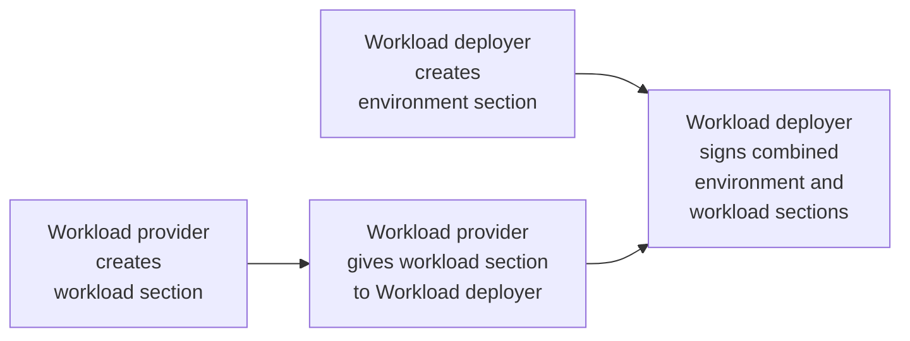

# Create contract for HPVS guest

## Overview of this section

IBM provides the Secure Execution feature on z15 and newer generations of its IBM Z and LinuxONE servers.  Currently, that's z15 and LinuxONE III for the "z15" generation and z16 and LinuxONE Emperor 4 for the "z16" generation.

You could create your own Secure Execution-enabled KVM guests and run a workload in it without Hyper Protect Virtual Servers 2.1.x.  However, there's non-trivial work involved in setting this up.  HPVS 2.1.x has done that hard work for you, and provided a KVM guest image that will run your application workload as an OCI-compliant (again, think "Docker" in the popular vernacular) container within the HPVS 2.1.x KVM guest.  There is still some work involved in setting up the contract that HPVS 2.1.x expects- but this is work closer to the _application_ or _business_ level. There is also added value in HPVS 2.1.x in areas such as:

- [x] logging
- [ ] attestation
- [x] verification during boot
- [x] encryption
- [ ] persistent disk protection
- [x] separation of duties

This lab covers the features that are checked in the list above.  (We won't rest on our laurels until we've built this lab out to cover everything under the sun, but, as the saying goes, _Rome wasn't built in a day_).

One of the things we just mentioned in the previous paragraph was _separation of duties_. In a real world situation, multiple personas could create different portions of the contract:

- an _application owner_ deployer might create the _workload_ section of the contract
- a _systems administrator_ might create the _environment_ section of the contract

Then, you could imagine the following scenario taking place:

1. application owner can encrypt their piece of the contract such that it can only be decrypted within the HPVS 2.1.x runtime
2. application owner passes their encrypted piece of the contract to the _systems administrator_
3. the _systems administrator_ encrypts their own section
4. the _systems administrator_ combines the two sections and signs the resultant contract so that it can be verified by the HPVS 2.1.x runtime.

!!! Question "Your inquiring mind may say, well that's all well and good, but what about the disk storage of the machine?"
	
	If your workload requires persistent disk storage (to survive a container restart) then each of the two personas supplies part of a seed that is used in the calculation of an encryption key for the persistent disk. Neither persona has knowledge of the other's part of the seed if it is passed between parties encrypted, so that no human has the ability to decrypt the persistent disk.  The HPVS developers have thought through security very carefully! :nerd_face: 

Now this lab does not include all of the above features- for example, in this lab we are not using persistent disk storage.  And for this lab, you have and will continue to wear many hats, including both the _application owner_ workload deployer and the _system administrator_ environment deployer, performing many roles that in the "real world" are likely to be delegated to multiple individuals.  We are not going to cover _attestation_ in this lab either, but hope to do so in a future lab.

## Creation of directory structure for contract 

This section starts where the last section left off- on your session with the RHEL host:


Create a directory structure for creating an HPVS 2.1.x contract:

   ``` bash
   mkdir -p ${HOME}/paynowLab/contract/{environment/rsyslog,workload/play}
   ```

Now see the directory structure you just created:

   ``` bash
   cd ${HOME} && tree paynowLab/contract
   ```

???+ info "Expected output from tree command"
      ```
      	[student03@bczkvm(192.168.22.64) ~ [12:23:58] (0)]$ tree paynowLab/contract
		paynowLab/contract
		├── environment
		│   └── rsyslog
		└── workload
			└── play

		4 directories, 0 files
      ```

Read about the directory structure and the purpose of each directory:

| Directory | Purpose |
|---|---|
| paynowLab/contract | Top-level directory for the contract for the PayNow application. Typically, the "workload deployer" signs the concatenation of the encrypted "environment" section that they create and the encrypted "workload" section that the "workload provider" creates. |
| environment | Used by the "workload deployer" persona to hold an encrypted environment section of the contract |
| rsyslog | Used to hold the artifacts needed to construct the logging subsection of the environment section |
| workload | Used by the "workload provider" to hold an encrypted workload section of the contract |
| play | Used to hold the pod descriptor file specifying the application image and supporting files |

A contract requires a _workload_ section and an _environment_ section, and they each get their own directory. Then the sections are packaged together, and signed, and the signature is added as the third section.  This final result- the contract-  will be stored in your `${HOME}/paynowLab/contract` directory.

While creating the contract in this lab, you will be performing the role of _workload provider_ and _workload deployer_. In most production scenarios these two roles would be performed by different persons or processes.  The following diagram shows at a high level how these two roles cooperate to form the contract:



## Create workload section of the contract

HPVS expects the contract to specify an OCI container specified by a _Docker Compose_ file or _pod descriptor(s)_.  A _Docker Compose_ file specifies an OCI image to run and other information necessary to configure the resulting container. A _pod descriptor_ works much the same way but Hyper Protect supports using one or more OCI images with a _pod descriptor_ as opposed to one image with a _Docker Compose_ file. Since this makes _pod descriptors_ more versatile, we will be using the new hotness, _pod descriptors_, in our lab as opposed to the the OG _Docker Compose_ file format. Having said that, both are currently valid. Your workload is the PayNow Demo. You created an OCI image for that on your standard KVM guest earlier in the lab.  In order to allow you to perform the lab without having to have an account at Docker or Quay.io or another image registry service, the instructors have created an OCI image that is hosted in Quay.io and is used for this section of the lab.  This OCI image was created in the exact same way you created the image on your standard KVM guest.  

### Create play subsection

Switch to the directory that will hold your pod descriptors:

``` bash
cd ${HOME}/paynowLab/contract/workload/play
```

!!! Info "Play time"

	The _pod descriptors_ use the `play` subsection which should conjure up thoughts of the `podman play kube` subcommand.

Create the _pod descriptor_:

``` bash
cat << EOF > pod.yml
apiVersion: v1
kind: Pod
metadata:
  name: paynow
spec:
  containers:
  - name: paynow
	image: quay.io/bsilliman/paynow@sha256:6c0d9c82bd051f4c2641d4ed9d4a3c577075894ad3bf1494f2c742a5751b93d9
    ports:
	- containerPort: 8443
	  hostPort: 8443
  restartPolicy: Always
EOF
```

Notice the value of the _image_ key.  This is the PayNow Demo image created by the instructor and hosted on Red Hat's Quay.io registry service. 

### Add a convenience script to create the workload section

You are almost finished with the workload section.  One thing to do is to add a convenience script to the workload directory.  This script is not
supplied with the product, but is very useful in the creation of the contract.  Create it now and feel free to peruse it but do not run it now.
It will be called later by another script.  Comments have been added to help explain what the script does. 

Switch directories:

   ``` bash
   cd ${HOME}/paynowLab/contract/workload/
   ```

Create the convenience script:

   ``` yaml
   cat <<-EOF > flow.workload
   # Create the workload section of the contract and add the contents in the workload.yaml file.
   
   # 
   # The pod descriptor and all supporting configuration files are assumed to be in the ./play directory
   # There should not be any unnecessary files as they will get tarred up and added to the PLAY_B64 variable
   #
   PLAY_B64=\$(tar -czv -C play . | base64 -w0)
   
   #
   # This specifies an intermediate file that could be deleted at the end of the script but 
   # is left intact for lab learning purposes-  it is plaintext so keeping it implies that
   # you would have to protect it appropriately.  In production you'll probably want to delete it
   #
   WORKLOAD_PLAIN=./workload.yaml.plaintext
   
   #
   # This specifies a file will be encrypted and signed and is the primary output of this script.  
   # It is combined with the encrypted and signed environment section that is created by 
   # another script (flow.signature which is one directory level higher)
   # Note: this file will also wind up one directory level higher
   #
   WORKLOAD=workload.yaml
   
   echo "  type: workload
     play:
       archive: \${PLAY_B64}" > \${WORKLOAD_PLAIN}
   
   #
   # This is the encryption certificate for Hyper Protect Container Runtime and it is
   # provided with the Hyper Protect Virtual Servers v2.1.7.1 product
   #
   CONTRACT_KEY=/data/lab/hpvs2171Certs/ibm-hyper-protect-container-runtime-23.11.1-encrypt.crt
   
   #
   # This variable holds a random password:
   #
   PASSWORD_WORKLOAD="\$(openssl rand 32 | base64 -w0)"
   
   #
   # This variable holds the output of the command pipe that
   # takes your plaintext workload yaml ($WORKLOAD_PLAIN) and encrypts it using the password that 
   # was generated above ($PASSWORD_WORKLOAD) and then base64 encodes this encrypted workload
   #
   # As long as nobody else knows your random password ($PASSWORD_WORKLOAD) your data is safe.  
   # But, the Hyper Protect Container Runtime has to encrypt it, so it needs your password. 
   # How will it get that password securely?  Read the next set of comment lines to find out.
   #
   ENCRYPTED_WORKLOAD="\$(echo -n "\$PASSWORD_WORKLOAD" | base64 -d | openssl enc -aes-256-cbc -pbkdf2 -pass stdin -in "\$WORKLOAD_PLAIN" | base64 -w0)"
   
   #
   # This variable provides secure passage of your random password.  How?  
   # It encrypts it with the encryption key of the Hyper Protect Container Runtime (HPCR).
   # (A key that is encrypted by another key is often called a wrapped key).
   # Only the HPCR image has the private key which can decrypt this. It is protected from 
   # access from any administrators.  So, malicious actors cannot do anything with this
   # wrapped key, even if they were able to get a hold of it.
   # 
   #
   ENCRYPTED_WORKLOAD_PASSWORD="\$(echo -n "\$PASSWORD_WORKLOAD" | base64 -d | openssl rsautl -encrypt -inkey \$CONTRACT_KEY -certin | base64 -w0 )"
   
   #
   # Use the following command to get the encrypted section of the contract:
   # This variable holds the output of a concatenation of a header, "hyper-protect-basic",
   # Your wrapped key, and your encrypted workload. 
   #
   WORKLOAD_ENCRYPTED="hyper-protect-basic.\${ENCRYPTED_WORKLOAD_PASSWORD}.\${ENCRYPTED_WORKLOAD}"
   
   #
   # The above variable is echoed to the a file the directory one level above
   #
   echo "\$WORKLOAD_ENCRYPTED" > ../\$WORKLOAD
   
   # 
   # NOTE: In a production scenario the plaintext workload section would be 
   # deleted or stored securely but it has been left here for student perusal.  
   # The filename is workload.yaml.plaintext
   #
   EOF
   ```

## Create environment section of the contract

1. Change to the directory where you will prepare for environment section of the contract:

	``` bash
	cd ../environment

	```

2. In the environment section of the contract you are going to specify the information in 
order to have your HPVS KVM Guest log to the rsyslog service that you configured earlier in the lab.

	1. Switch to the directory from where you will gather some files you will need for this rsyslog configuration:

		``` bash
		cd rsyslog
		```

	2. You will need the CA certificate of the rsyslog service that you created on your Ubuntu KVM guest which you can get via _scp_:

		``` bash
		scp student@${StudentGuestIP}:x509Work/rsyslog/CA/ca.crt .

		```

	3. Copy your rsyslog client certificate from your working directory:

		``` bash
		cp -ipv ${HOME}/paynowLab/x509Work/rsyslogClient/paynowLab-client.crt .

		```

	4. Convert the private key to PKCS#8 format
	
		The directory you just copied the client certificate from also has your private key that you need. However, the HPCR image requires this to be in PKCS#8  (Public Key Cryptography Standard #8) format. Therefore you can't just copy it over- you need to convert it to PKCS#8 format:

		``` bash
		openssl pkcs8 -topk8 -inform PEM -outform PEM -nocrypt \
			-in ${HOME}/paynowLab/x509Work/rsyslogClient/client-key.pem \
			-out client-key-pkcs8.pem

		```

	5. Go back up one directory level:

		``` bash
		cd .. && pwd

		```

	6. We have provided a convenience script to assist in creating the environment section of the contract
	
		This script is not supplied with the product, but is very useful in the creation of the contract. Create it now and feel free to peruse it but do not run it now. It will be called later by another script. Comments have been added to help explain what the script does. 

		``` yaml
		cat <<-EOF > flow.env
		# Create the env section of the contract and add the contents in the env.yaml file.

		#
		# set some file locations at the top of the file here
		#
		RSYSLOG_CA_CRT="./rsyslog/ca.crt"
		RSYSLOG_CLIENT_CRT="./rsyslog/paynowLab-client.crt"
		RSYSLOG_CLIENT_KEY="./rsyslog/client-key-pkcs8.pem"

		#
		# This specifies an intermediate file that could be deleted at the end of the script but 
		# is left intact for lab learning purposes-  it is plaintext so keeping it implies that
		# you would have to protect it appropriately.  In production you'll probably want to delete it
		#
		ENV_PLAIN="./env.yaml.plaintext"

		#
		# This specifies a file will be encrypted and signed and is the primary output of this script.  
		# It is combined with the encrypted and signed workload section that is created by 
		# another script (flow.signature which is one directory level higher)
		# Note: this file will also wind up one directory level higher
		#
		ENV="env.yaml"

		#
		# This variable holds the output of taking all the newlines out of the rsyslog CA certificate and
		# replacing them with the "\n" characters.  In other words, a multiple line file is squashed down 
		# to one line.  The HPCR runtime image will then convert it back to the multiple line format
		#
		ENV_RSYSLOG_SERVER=\$(awk -vRS="\n" -vORS="\\\\\n" '1' \${RSYSLOG_CA_CRT})

		#
		# This variable holds the output of taking all the newlines out of the client certificate that the
		# HPCR runtime uses for communicating with rsyslog and replacing them with the "\n" characters.
		# In other words, a multiple line file is squashed down to one line. THe HPCR runtime image will 
		# then convert it back to the multiple line format
		#
		ENV_RSYSLOG_CERT=\$(awk -vRS="\n" -vORS="\\\\\n" '1' \${RSYSLOG_CLIENT_CRT})

		#
		# This variable holds the output of taking all the newlines out of the client private key that the
		# HPCR runtime uses for communicating with rsyslog and replacing them with the "\n" characters.
		# In other words, a multiple line file is squashed down to one line. THe HPCR runtime image will 
		# then convert it back to the multiple line format. Before this all happens, the Private Key is 
		# converted to PKCS#8 format
		#
		ENV_RSYSLOG_KEY=\$(awk -vRS="\n" -vORS="\\\\\n" '1'  \${RSYSLOG_CLIENT_KEY})


		echo "  type: env
		  logging:
		    syslog:
		      hostname: \"\${StudentGuestIP}\"
		      port: 6514
		      server: \"\${ENV_RSYSLOG_SERVER}\"
		      cert: \"\${ENV_RSYSLOG_CERT}\"
		      key: \"\${ENV_RSYSLOG_KEY}\"" >\${ENV_PLAIN}

		#
		# This command adds the public signing key to the plaintext environment yaml.  This key is used inside 
		# the Hyper Protect Container Runtime image to verify the signature over workload and environment sections of
		# the contract. 
		#
		cat ./pubSigningKey.yaml >> \${ENV_PLAIN}

		# This is the encryption certificate for Hyper Protect Container Runtime and it is
		# provided with the Hyper Protect Virtual Servers v2.1.7.1 product
		#
		CONTRACT_KEY=/data/lab/hpvs2171Certs/ibm-hyper-protect-container-runtime-23.11.1-encrypt.crt

		#
		# This variable holds a random password:
		#
		PASSWORD_ENV="\$(openssl rand 32 | base64 -w0)"

		#
		# This variable holds the output of the command pipe that
		# takes your plaintext environment yaml (\$ENV_PLAIN) and encrypts it using the password that 
		# was generated above (\$PASSWORD_ENV) and then base64 encodes this encrypted environment yaml
		#
		# As long as nobody else knows your random password (\$PASSWORD_ENV) your data is safe.  
		# But, the Hyper Protect Container Runtime has to encrypt it, so it needs your password. 
		# How will it get that password securely?  Read the next set of comment lines to find out.
		#
		ENCRYPTED_ENV="\$(echo -n "\$PASSWORD_ENV" | base64 -d | openssl enc -aes-256-cbc -pbkdf2 -pass stdin -in "\$ENV_PLAIN" | base64 -w0)"

		#
		# This variable provides secure passage for your random password.  How?  
		# It encrypts it with the encryption key of the Hyper Protect Container Runtime (HPCR).
		# (A key that is encrypted by another key is often called a wrapped key).
		# Only the HPCR image has the private key which can decrypt this. It is protected from 
		# access from any administrators.  So, malicious actors cannot do anything with this
		# wrapped key, even if they were able to get a hold of it.
		#
		ENCRYPTED_ENV_PASSWORD="\$(echo -n "\$PASSWORD_ENV" | base64 -d | openssl rsautl -encrypt -inkey \$CONTRACT_KEY -certin | base64 -w0 )"

		#
		# Use the following command to get the encrypted environment section of the contract:
		# This variable holds the output of a concatenation of a header, "hyper-protect-basic",
		# Your wrapped key, and your encrypted environment yaml.. 
		#
		ENV_ENCRYPTED="hyper-protect-basic.\${ENCRYPTED_ENV_PASSWORD}.\${ENCRYPTED_ENV}"
		#
		# The above variable writes the encrypted environment section to the directory one level above
		#
		echo "\$ENV_ENCRYPTED" > ../\$ENV
		EOF
		```

3. Backup one more directory level:

	``` bash
	cd ..

	```

4. You will create three more files that are convenience scripts, similar to _flow.workload_ and _flow.env_ which you have already created:

	1. The first script will provide some preparation steps.  Create it, peruse it, love it, but don't run it yet:

		``` bash
		cat << EOF > flow.prepare

		# Use the following command to generate a key pair to sign the contract 
		openssl genrsa -aes128 -passout pass:test1234 -out private.pem 4096
		openssl rsa -in private.pem -passin pass:test1234 -pubout -out public.pem

		# The following command is an example of how you can get the signing key:
		key=\$(awk -vRS="\n" -vORS="\\\\\n" '1' public.pem)
		echo "  signingKey: \"\${key%\\\\n}\"" > environment/pubSigningKey.yaml
		EOF
		```

	2. Create the second script which signs the concatenated workload and environment sections of the contract and then appends the signature as the third and final element of the contract.  Don't run it yet!

		``` bash
		cat << EOF > flow.signature
		# combine workload and environment
		cat workload.yaml env.yaml | tr -d '\n' > contract.yaml

		# Sign the combination from workload and env being approved
		echo \$( cat contract.yaml | openssl dgst -sha256 -sign private.pem -passin pass:test1234 | openssl enc -base64) | tr -d ' ' > signature.yaml

		# Create user data and add signature:
		echo "workload: \$(cat workload.yaml)
		env: \$(cat env.yaml)
		envWorkloadSignature: \$(cat signature.yaml)" > user_data.yaml

		echo ""
		echo "import \`pwd\`/user_data.yaml into User Data or copy and paste from below:"
		echo ""

		cat user_data.yaml
		EOF
		```

	3. This script isn't strictly necessary for the lab for reasons stated in the comments in the script, but you can create it anyway:

		``` bash
		cat << EOF > flow.clear
		#
		# It isn't really necessary to run this in our lab environment 
		# because the other scripts will happily trod on these files 
		# as necessary.
		#
		# It is more likely that you would run this after running the
		# other scripts in order to remove these files for security
		# reasons
		#
		# But if you ever had a need to save your signing key pair, 
		# you would want to save private.pem somewhere safe.
		# 
		rm private.pem public.pem
		rm environment/pubSigningKey.yaml environment/env.yaml.plaintext
		rm workload/workload.yaml.plaintext
		rm env.yaml workload.yaml contract.yaml signature.yaml user_data.yaml
		EOF
		```

## Encrypt and sign the contract

1. Create a final helper script which calls the _flow.*_ scripts you created earlier:

	``` bash
	cat << EOF > makeContract
	. ./flow.prepare
	cd workload
	. ./flow.workload
	cd ../environment
	. ./flow.env
	cd ..
	. ./flow.signature

	EOF
	```

2. Now run the helper script that you just created:

	``` bash
	. ./makeContract

	```

The script creates the final contract in a file named `user_data.yaml`.  It also displays the contents of this file to the screen. At the bottom of the output you will see an _envWorkloadSignature_ key.  If there is a gobbledygook value (base64-encoded text) associated with this key then things went well.

## Create the startup file for the HPVS KVM guest

1. Create a copy of the `user_data.yaml` file that your created

	The contract that you just created is going to be packaged with some other files into a startup file for your HPVS KVM guest that will run the PayNow demo. One of the files expected is a file named `user-data` that is just a copy of the `user_data.yaml` file that was just created

	``` bash
	cp -ipv user_data.yaml user-data

	```

	!!! Info "Why didn't the script just do the above copy for me"

		We kept _user-data_ intact in case something went wrong in the process, in which case _user_data.yaml_ may be rubbish but at least you haven't trampled on a good _user-data_ that might already be in use.  


2. Create `vendor-data` which is another file required by the process:

	``` bash
	cat << EOF > vendor-data
	#cloud-config
	users:
	- default
	EOF

	```

3. Create `meta-data` which is also required, and it will have a hostname tailored for your userid:

	``` bash
	cat << EOF > meta-data
	local-hostname: $(whoami)-paynowdemo
	EOF

	```

4. Run this command (RHEL-specific, see product documentation for Ubuntu command) in order to create the startup file, _ciiso.iso_:

	``` bash
	genisoimage -output /var/lib/libvirt/images/labs/paynow/$(whoami)/ciiso.iso \
		-volid cidata -joliet -rock user-data meta-data vendor-data

	```
   
	Your output will look like this:

	???- example "Output from genisoimage command"

		```
		I: -input-charset not specified, using utf-8 (detected in locale settings)
		Total translation table size: 0
		Total rockridge attributes bytes: 414
		Total directory bytes: 0
		Path table size(bytes): 10
		Max brk space used 0
		203 extents written (0 MB)
		```

Please click the _Next_ link at the bottom of the page to continue with the lab.
